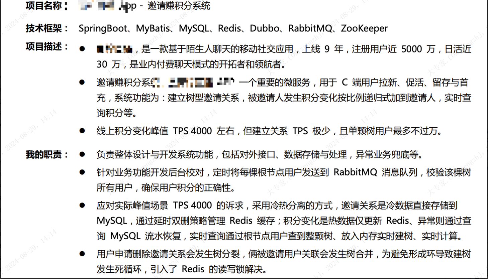
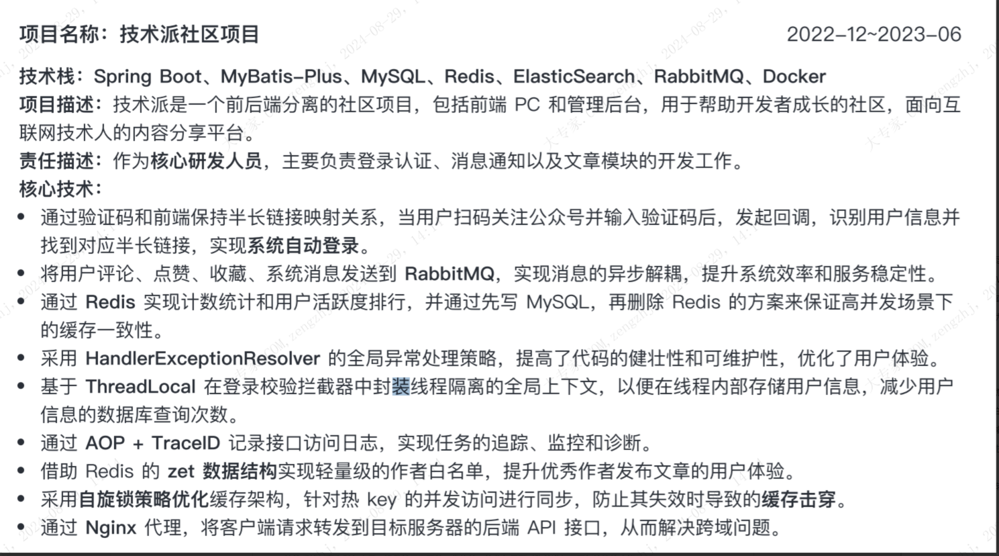
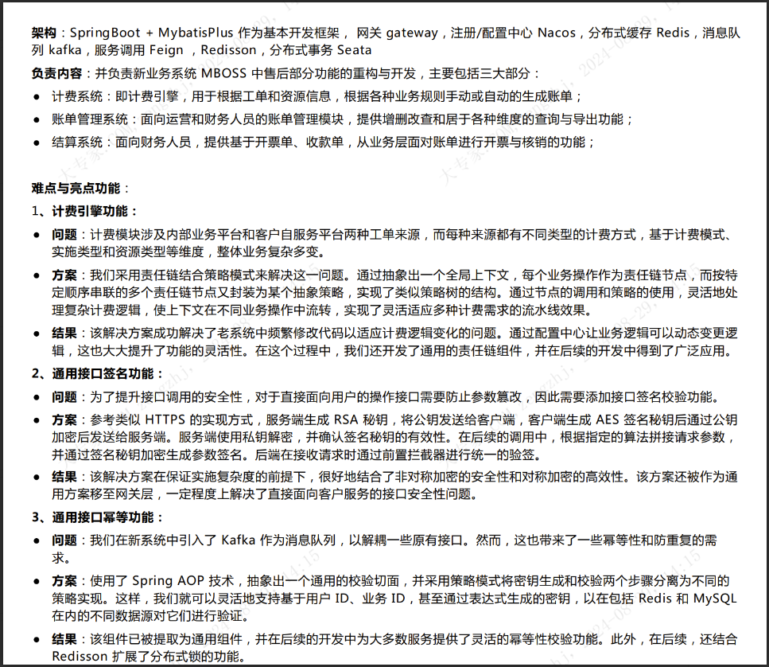
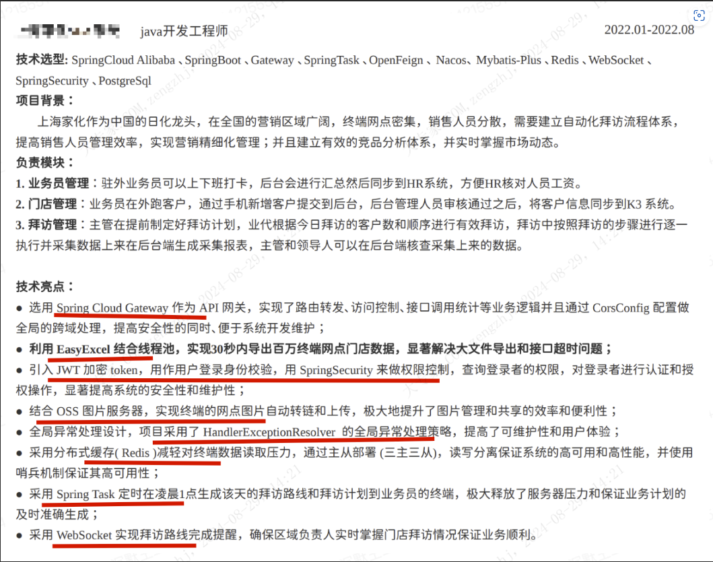

这几个词，每个人理解都不一样。

比如面试官的理解：
- 了解：就是你知道有这么一个东西，大概能用来干麻
- 熟悉：就是你经常在使用，但是未必深入的学习过
- 掌握：就是你能用这个东西来完成一些功能，解决一些问题，但是还不熟练，可能还需要边查边做
- 熟练：就是你成为一个熟练工了，能够快速搞定功能模块、代码需求，完全不用思考。甚至高端点的人，有自己的代码库和工具箱了，那搭建项目、完成功能，就是复制黏贴（自己的代码），飞快。而且很多地方都自动化完成了。
- 精通：在某一方面的技术有一定的影响力，对技术的优缺点、适用场景有非常深刻的理解。提交过开源代码，
回答过别人的问题，一般技术问题都难不倒你。

但是面试者的理解也可能是：
- 了解：听说过名字
- 熟悉：会Hello World
- 掌握：基本上看过文档，知道相关知识
- 熟练：拿来写过项目
- 精通：用这个技术写了很久的业务

球友们可以按需选择不同的词汇来描述，千万不要全部掌握，全部熟悉，全部了解，看起来干篇一律，食之乏味。尽量不要直接上来就写精通了，免得会被面试官问死，除非是自己确实很自信。

让专业技能看起来不那么死板且重点突出（扣原则：突出重点）

专业技能举例：
1. 具备扎实的Java基础以及面向对象编程思想，熟悉Git、Maven等进行项目版本管理
2. 熟练掌握spring、springboot、mybatis等常用开发框架，深入学习其原理，如：IOC、AOP、循环依赖、自动装配等
3. 熟悉Mysql常用操作，具备优化SQL、表结构设计、分库分表等经验，熟悉mvcc机制、事务、索引等Mysql理论知识
4. 熟练掌握NoSql数据库redis,对其原理有深入了解，如主从同步、持久化、淘汰机制、部署方式等
5. 熟悉JVM相关知识，如垃圾回收算法、对象创建过程、类加载机制等
6. 熟悉RPC框架dubb0,深入学习其底层知识，如调用链路、负载均衡、容错机制等
7. 熟悉注册中心zookeeper,深入学习其底层知识，如zab协议、leader选举、数据同步等
8. 熟练使用消息队列kafka,对其核心原理有深入的学习，如负载均衡、可靠性保证、leader选举、分区分配策略等
9. 对于网络知识有一定的了解，如三握四挥、滑动窗口、粘包等
10. 熟悉多线程开发，熟悉线程池原理，锁等
11. 对于分布式微服务有深入的理解，对常见问题的解决方案有深入理解，如分布式锁、分布式事务、cap理论、raft协议等

大家会发现，其实面试官「基本都是按照你写的技能」去问的，基本要求就是你简历上写的东西，你都需要熟悉，基本技能栏一定要「体现某些技术的深度」，能让面试官看出来你平常会有自己去深度学习。

---

### 项目

关于项目，有2点我希望大家可以提前准备，属于高频问题。
1. 梳理自己项目的难点或亮点是什么？
2. 项目中，为什么用x技术点，用yy的可以吗？或者为什么这么设计？

关于第一点，这个内容即使面试官没问，我们也可以在自我介绍时候表述出来。

如果你觉得自己的项目的确没什么厉害的东西，都是业务的cud。那就挑一个值得说过的优化，或者设计方案也行。

毕竟高大上的东西的确只有少数人接触到，都是理解的。

接下来关于第二点，目的是考察你对自己项目的理解是不是真的知其所以然，还是说自己只是一个无情的cud机
器。

这个版块非常重要，现在大多数面试官已经厌倦问八股了，比较实在且专业的面试言都会围绕项目经验展开提问，八股可以背，但项目这块就要看硬实力，也就是编码功底了，如果项目没有深入去研究，很多问题你就答不上来。

这块一股有几个考察点：
- 最后一家公司经历（大厂优先）
- 公司个数和每个公司的任职年限（稳定的优先）
- 项目复杂度
- 个人的贡献和成果
  
正确的项目经历包括这几部分：
- 项目概述（言简意赅）
- 个人职责（主要负责人还是协作方，负责哪些方面）
- 技术难点或者项目难点（这是面试官比较关心的）
- 成果业绩（数据量化）
  
涉及关键内容可加粗处理，醒目突出（但切记只加粗关键字，或者大量加粗）

我觉得可以适当减少项目具体的业务描述（尽量少写），我建议重点描述自己解决了什么问题，优化了什么地方，
比如：
- 解决了X服务请求超时的问题。
- 优化了接口，将QPS由1000提升到了5000等等。

来看一个工作党的项目经历，是我认为比较突出的。项目名称、技术框架、项目描述、职责描述这4个关键的点都写出来了。项目描述中重点讲了项目的注册用户、TPS等关键数据，HR/面试官看到这就知道，这个项目是很具象的，从数据量就能判断出这个项目到底是不是核心项目。

再来看一个学生党的项目经历，用了星球的原创项目技术派，项目名称（开发周期）、技术栈、职责描述、核心技术等关键信息部体现出来了。并且职责描述中具体用了哪些核心技术、解决了哪些问题、有哪些亮点都面面俱到了。

还有下面这种写法，也是我非常喜欢的，项目用了哪些技术栈，自己负责的业务是什么样的，然后针对不同的业务，遇到了什么问题，解决方案是什么，得到的结果是什么样的，都非常清楚，让人看了有一种掌控全局并且一看就是核心开发的感觉。

正例：下面这个基本上就能体现出来具体用到了什么技术栈，解决了什么问题，提到的技术栈基本上也都得到了应用。

项目经历栏举例：

